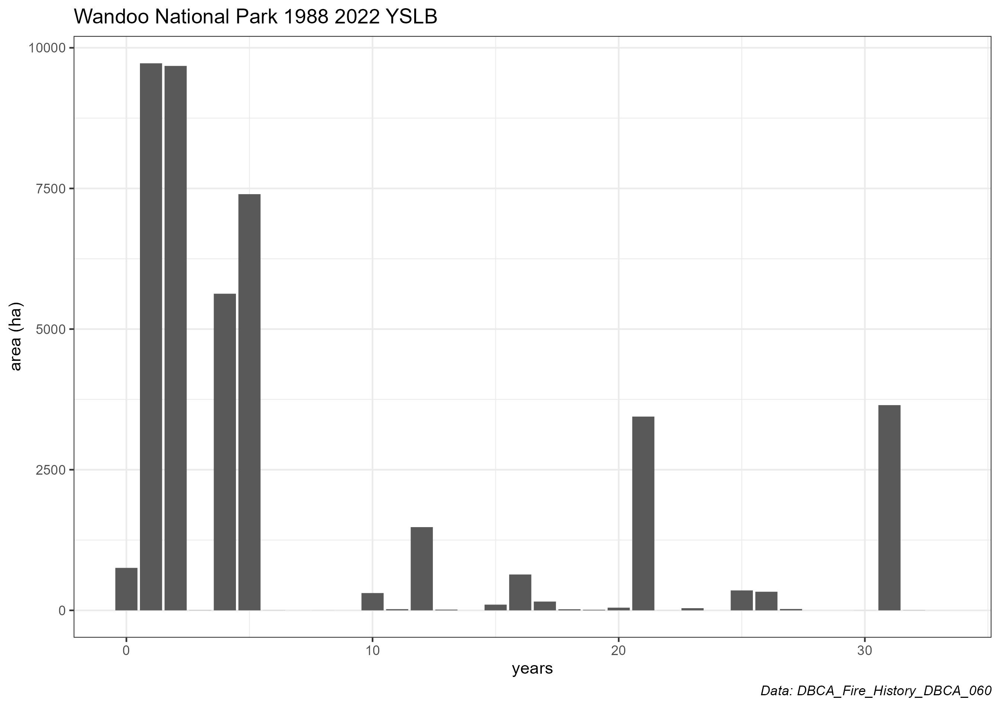

```{r, include = FALSE}
knitr::opts_chunk$set(
  collapse = TRUE,
  comment = "#>"
)
```


## Welcome to the FireHistory package!
`FireHistory` is an R package designed to assist researchers get the best out of 
the Department of Biodiversity, Conservation and Attraction's (DBCA) fire history 
dataset (DBCA_Fire_History_DBCA_060). The fire history is a very large spatial 
polygon dataset comprising of collated fire events (prescribed burns and bushfires) 
that have occurred on departmental lands. Earliest records date from 1937 and the 
data is updated regularly. The data can be accessed on the [data WA website](https://catalogue.data.wa.gov.au/dataset/dbca-fire-history).

There are 3 main steps in the `FireHistory` workflow:

* Downloading data
* Getting the data prepped for analysis
* Generating metrics

## Downloading the Fire History dataset
The `FireHistory` package relies on the DBCA dataset to be downloaded and available 
locally. Unfortunately at this stage an API workflow is not available. As the data 
is dynamic care must be taken to ensure that the data downloaded is the latest 
available.

To download the data please follow this link [data WA website](https://catalogue.data.wa.gov.au/dataset/dbca-fire-history). 
Go to the `Data Downloads` drop down menu and click the download for shapefile button. 
This button will take you to the Shared Location Information Platform (SLIP) managed 
by Landgate. You will need to register and login as a user. Access is free and the 
login requirement is for statistics only. Once logged in you will have the ability 
to download the data in two different Datums. Please choose the GDA2020 version.

At time of writing the download was 939MB and should take a few minutes depending 
on connection speeds. Make sure you save it somewhere locally on your computer and 
remember how to get to it.

While on the data WA website, also click on the `Resources` drop down menu and 
download the PDF of "Look-up Tables". This has important information about the 
attribute columns in the downloaded shapefile if you wish to further understand 
and explore the fire history data.

## Data preparation
First things first, you will need to download the package and load it. You can only 
install the package from the GitHub repository. If you haven't already installed 
R package `devtools` you will need to do this first. 
```{r, eval=FALSE}
# install.packages("devtools")
devtools::install_github("dbca-wa/FireHistory")
library(FireHistory)
```

```{r, eval=TRUE, echo=FALSE}
library(FireHistory)
```
The basic workflow of data preparation is that a polygon/s representing an area of interest 
(AOI) will be used to spatially subset the DBCA fire history which will be further 
temporally filtered based on some user parameters. There are two options for defining 
an aoi.

### User supplied AOI
Got your own shapefile that you would like to use? No problems.
```{r, eval=FALSE}
# file path to your shape file - note includes the file extension
my_shape <- "C:/somewhere/myshapefile.shp"

# import it
aoi <- user_aoi(aoi_path = my_shape, name = "A very meaningful name")
```
Make sure your shapefile has a coordinate reference system. There doesn't need 
to be any specific information in the attribute table and there can be multiple 
polygons if necessary as long as when assessed together it makes sense. The parameter 
`name` should be something helpful as all your products and plots will feature this.

### DBCA tenure or forest block AOI
Want to use a National Park boundary or a forest block as the AOI but don't know 
how to get it or what it's full name is? No problems. The package ships with a 
complete listing of tenure and forest block names as well as their boundaries. 
```{r, message=FALSE, warning=FALSE}
# For DBCA tenure - have a look at the first few records....there's 1000+
head(find_tenure())

# Or for DBCA forest blocks
head(find_block())
```

That could take a while. Say we are pretty sure our National park AOI has something 
to do with wandoo.
```{r, message=FALSE, warning=FALSE}
# search for something like wandoo
find_tenure(like = "wandoo")

# there are a few close matches but we want the first one and save it to an object
location <- find_tenure(like = "wandoo")[1]
```

Alternatively, we might be looking for a forest block called Jasper
```{r, message=FALSE, warning=FALSE}
# search for something like jasper
find_block(like = "jasper")

# there is only one so no need to subset this time
location <- find_block(like = "jasper")
```

Now that we have the correct name we can retrieve the DBCA spatial boundary and save it 
as our AOI. The `DBCA_aoi` function's default behaviour is to return a tenure boundary. 
For a forest block make sure you add the extra parameter.
```{r, eval=FALSE}
# if the aoi is a tenure location
aoi <- DBCA_aoi(choice = location)

# if the aoi is a forest block
aoi <- DBCA_aoi(choice = location, block = TRUE)
```

Whichever way you define an AOI these functions will return a list containing 
a spatial object and its name.

After defining the AOI, you use it to subset the downloaded fire history data.
```{r, eval=FALSE}
# file path to the fire history data - note includes the file extension
path <- "C:/somewhere/DBCA_Fire_History_DBCA_060.shp"
# here we want to temporally restrict it to the period 1988-2022
wandoo_data <- assemble_data(fire_path = path, from = 1988, to = 2022, aoi = aoi)

# works the same for a forest block
jasper_data <- assemble_data(fire_path = path, from = 1988, to = 2022, aoi = aoi)
```

Whilst the fire history data is huge, as it is subset using the AOI prior 
to reading into memory, this process is reasonably fast (about 10-20 seconds for 
the wandoo data set). Saving it to an object (here called wandoo_data) is 
important as this will be passed along to the fire metrics functions. If there is 
nothing in the fire history for the AOI the function will return an error. The 
fire history is most complete on DBCA tenure  and forest blocks and generally 
even better in more populous regions/areas.

## Fire Metrics
Now it is time to generate some fire metrics. Here is an example to calculate 
Year Since Last Burn (YSLB) for the Wandoo example above.
```{r, eval=FALSE}
# create YSLB for the Wandoo National Park
yslb_list <- yslb(data = wandoo_data, products = TRUE)
```

By saving it to an object it creates a list containing:

* A YSLB raster of class SpatRaster (from the Terra R package)
* A YSLB map of class ggplot
* A tibble of area stats
* A YSLB column plot of class ggplot

By having a list of these products the user can extract them and manipulate the 
plot objects or directly use the raster in other analysis. The parameter `products = TRUE` 
will create a folder in your working directory and save the four products to it.

Examples of the plots are below.


